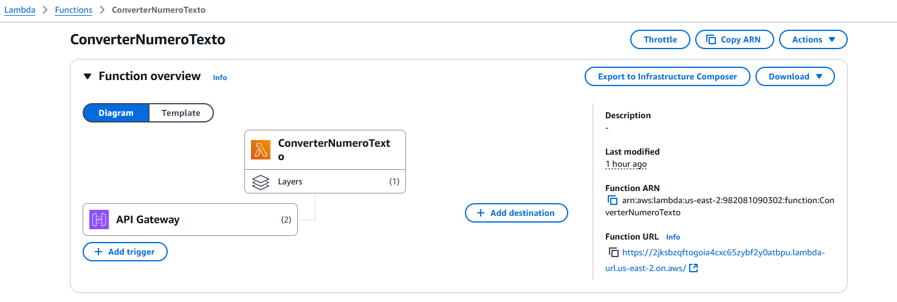

## Histórico do Projeto ##
- **Data de Criação:** 16 de Novembro de 2024
- **Última Edição:** 16 de Novembro de 2024

## Endpoint para a chamada da API ##
Obs: O número final pode ser alterado

https://fnwb75vgle.execute-api.us-east-2.amazonaws.com/converter?numero=452

## Imagens ##
### Arquitetura do Projeto

### Exemplo de Request e Response

## Link para as Imagens do Projeto no Notion ##
https://www.notion.so/Imagens-do-Projeto-14193517433c80e89f83e549202beac1?pvs=4
